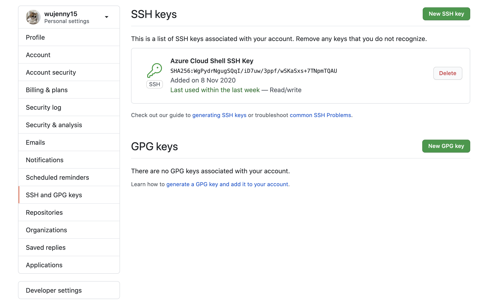
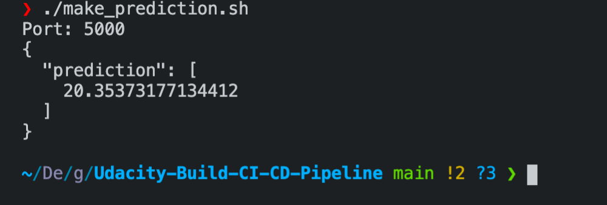
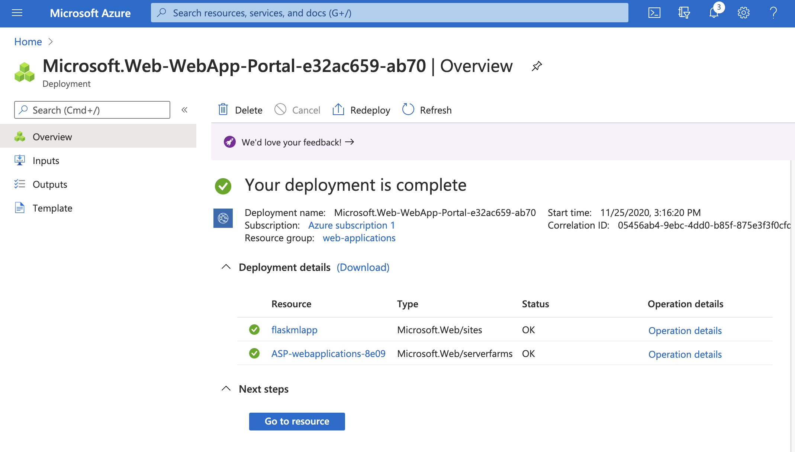
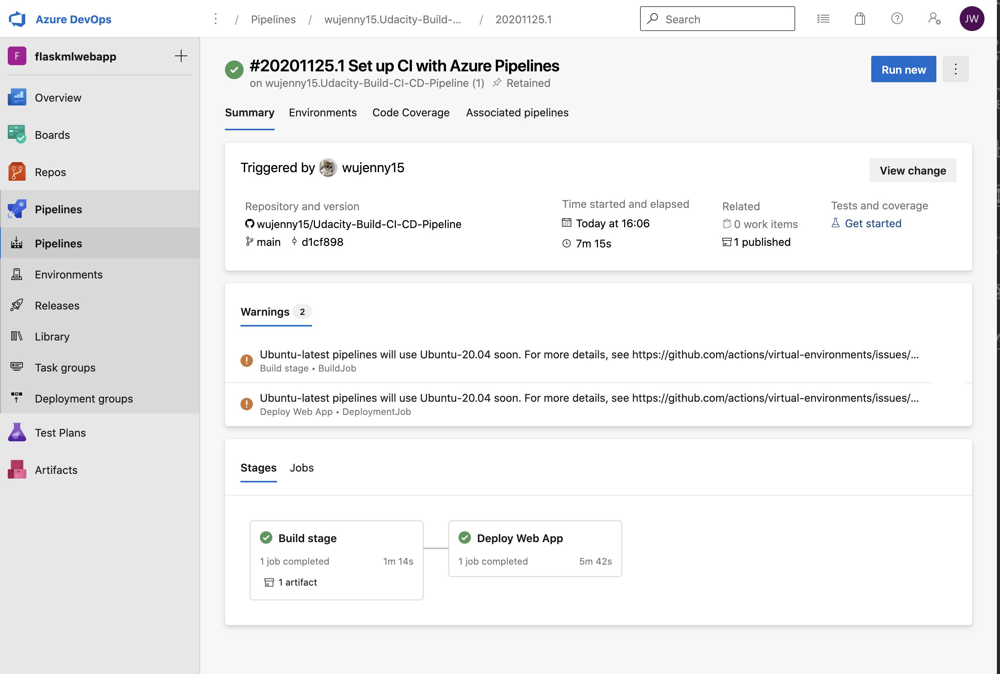
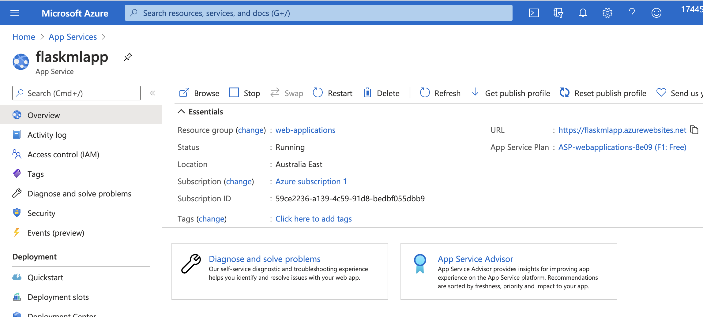

# Overview

This project will intergate an Azure Cloud Shell (CLI) envrionment and use it to build, test ,deploy and operate a Machine Learning poject.

## Project Plan
<TODO: Project Plan

* A link to a Trello board for the project
* A link to a spreadsheet that includes the original and final project plan>

## Instructions

<TODO:  
* Architectural Diagram (Shows how key parts of the system work)>

<TODO:  Instructions for running the Python project.  How could a user with no context run this project without asking you for any help.  Include screenshots with explicit steps to create that work. Be sure to at least include the following screenshots:
### CI : Set Up Azure Cloud Shell

:one: Create the Cloud-Based Development Environment

:white_check_mark: Create a Github Repo

:white_check_mark: Launch an Azure Cloud Shell environment and create ssh-keys. Upload these keys to your GitHub account.

* Go to Azure Portal -> Click Azure Cloud Shell
* Type `ssh-keygen -t rsa` to generate a key

* `cat /home/jenny/.ssh/id_rsa.pub`
* Copy the generated key and go to GitHub. Click the settings and paste the key.

### Inspect Project File
Since the environment is set up, we can inspect our project files and test our code locally first.

We will need these four files: Makefile, requirements.txt, app.py, and make_prediction.sh. ad

In order to install and manage the framework and libraries in the requirements.txt easily, we will need to create a virtual environment for python.

You can create a virtual environment like:

```bash
#Install the virtual command-line tool
pip install virtualenv

#create a virtual environment
virtualenv ~/.udacity-devops
```

I have created the `.udacity-devops` virtual environment in my mac, so I will simply activate it. You can double check whether which python we are using by tying "which python" in your terminal.

```
source ~/.udacity-devops/bin/activate
```

The python virtual env is set up, so we can install our packages or frameworks specified in the requirements.txt. We can run our commands with the help of Makefile. I really love using the Makefile, I mean who will remember all of those scripts? Simply type `make all` to install the packeages specified in the requirements.txt.
```
make all
```


I have successfully installed all the packages and now I want to test whether I can run the app.py application and make housing prediction successfully in my local machine. This procedure is really important. 

Type `Python app.py` in your terminal and run the application. 
  

Once it is successfully, you will see Sklearn Prediction Home in your browser.


Then, we want to make sure whether we call call our ML API. We do this open another terminal and type `./make_prediction.sh` in our terminal. We will be able to see the prediction.



Since we get the prediction value, it means our application works perfectly on our localhost. Then we will modify the port in app.py to 443 and commit our changes to the repo.
### Clone Project into Azure Cloud Shell

* Go to Azure Portal, Click the Azure CLI, and clone the project.


### Project running on Azure App Service
Azure app service is like our localhost but it is hosted in Azure. It is like black-box localhost. Azure APP service is PaaS so we do not need to specify the OS of the virtual machines and specify its configurations. So really easy to use. We simply use it to deploy our application.

To start with, we need to authorize Azure APP service. You can create a APP service from Azure Portal or in the cloud shell. I will use the Portal at the moment since I want it to be more clear and easy for me to understand.
like
```
az webapp up -n <your-appservice>
az webapp config set -g <your-resource-group> -n <your-appservice> --startup-file <your-startup-file-or-command>
```



We have already authorized the Azure APP Service and then we want to use Azure pipelines to deploy our flask ML webapplications. To do so, we need to create a Azure DevOps Project and then establish a service connection for Azure Pipelines and Azure App Service. Here is the tutorial you can follow along.

<a href ="https://docs.microsoft.com/en-us/azure/devops/pipelines/ecosystems/python-webapp?view=azure-devops&WT.mc_id=udacity_learn-wwl">Use CI/CD to deploy a Python web app to Azure App Service on Linux</a>

After follow along the above tutorial, we will deploy our web app successful with Azure Pipelines. It will look like



If we go to the App Service, and click the URL under the Essentials Tab , we should be able to vist it. And see it is actually hosted by azure now.



The successful prediction from deployed flask app in Azure Cloud Shell. The output should look similar to this:


### Running Azure App Service from Azure Pipelines automatic deployment
Now that we have set up the Azure Pipelines and deploy the Flask ML application on Azure, we want to make sure if we have made any changes on our GitHub Repo, the Azure Pipelines will be triggered and run the tasks in the pipelines and then deploy the applications automatically to Azure App Service. 

So, I will go to my app.py and add my heading as Continuous Delivery Test. By doing this, I want to check if I have set up my workflow correctly, after I made changes, the Azure Pipleines will be triggered and it will deploy my new changes to the App Service. 
```python
@app.route("/")
def home():
    html = "<h3>Sklearn Prediction Home (Continuous Delivery Test)</h3>"
    return html.format(format)
```


* Passing tests that are displayed after running the `make all` command from the `Makefile`
* Output of a test run
* Output of streamed log files from deployed application

## Enhancements

<TODO: A short description of how to improve the project in the future>

## Demo 
<TODO: Add link Screencast on YouTube>

